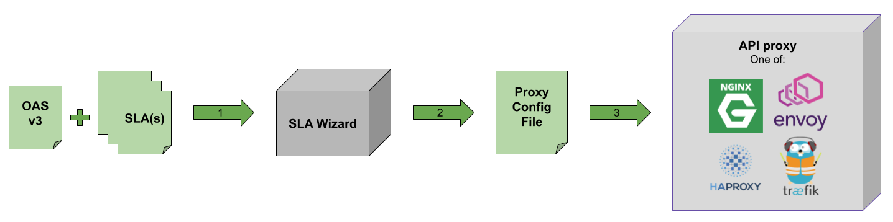

# SLA Wizard

## How it works



1. The user provides to SLA Wizard an OpenAPI Specification v3 and one or more SLAs agreement. 
2. SLA Wizard generates a proxy configuration file which includes the rate limiting indicated in the SLA(s). 
3. The obtained configuration is provided to the proxy server when launching it. The proxy can be one of: Envoy, HAProxy, Nginx or Traefik.
4. The API requests will be rate-limited according to the proxy configuratin file, which matches what the API SLA(s) indicate. 

## Usage

Once the tool is published in npm, it will be possible to install it using `npm install sla-wizard` but until then, to get the tool clone the repository and install dependencies:

```bash
git clone https://github.com/isa-group/sla-wizard
cd sla-wizard
npm install
```

Displayed below is the output of the `-h` option of SLA Wizard CLI:

```bash
$ node src/index.js -h
Usage: sla-wizard <arguments> <options>

Options:
  -h, --help                display help for command

Commands:
  config [options] <proxy>
  runTest [options]         Run test with APIPecker.
  help [command]            display help for command
```

### Commands

SLA Wizard includes currently two commands:

| Command  |  Explanation |
|---|---|
| `config`  |  Takes an SLA document and generates a proxy configuration file which includes rate limiting as specified on the provided SLA. |
| `runTest` |  Performs validation testing of the rate limiting defined on a proxy by an SLA Wizard-generated configuration file. |

To control log levels define the environment variable `LOGGER_LEVEL` prior to the run. The possible values are `error`, `warn`, `custom`, `info` and `debug`.

### Options

The following table describes all the options that SLA Wizard includes for its commands:

| Option/Argument  |  Command | Required  |  Explanation |
|---|---|---|---|
| `proxy` | `config` | Yes | Proxy for which the configuration should be generated. (choices: "nginx", "haproxy", "traefik", "envoy") |
| `-o`, `--outFile <configFile>` | `config` | Yes | Config output file. |
| `--sla <slaPath>` | `config` & `runTest`| No | One of: 1) single SLA, 2) folder containing SLAs, 3) URL returning an array of SLA objects (default: "./specs/sla.yaml"). Note in the case of `runTest` the URL option is not supported. |
| `--oas <pathToOAS>` | `config` & `runTest` | No | Path to an OAS v3 file. (default: "./specs/oas.yaml") |
| `--customTemplate <customTemplate>` | `config` | No | Custom proxy configuration template. |
| `--authLocation <authLocation>` | `config` | No | Where to look for the authentication parameter. (default: "header") |
| `--authName <authName>` | `config` | No | Name of the authentication parameter, such as "token" or "apikey". (default: "apikey") |
| `--specs <testSpecs>` | `runTest` | Yes | Path to a test config file. |
      

## Considerations

### SLA types

SLA Wizard only works with SLAs of type `agreement`. It validates the provided SLAs with the [SLA4OAI-Specification JSON schema](https://github.com/isa-group/SLA4OAI-Specification/blob/main/schemas/1.0.0-Draft.schema.json).
If any of the provided SLAs is not valid (does not conform to schema or is not of type agreement), the execution will stop. Additionally, duplicated SLAs will be ignored.

### API server reference in OAS

The API server must be indicated on the OAS document. While it is possible to specify multiple servers in the OAS' `servers` section, SLA Wizard will consider only the first one.
For instance, in the following example only `http://server1:8080` is considered:

```yaml
openapi: 3.0.0
servers:
  - url: 'http://server1:8080'
  - url: 'http://server2:8080'
  - url: 'http://server3:8080'
  ...
```

### SLA reference

Both SLA Wizard functionalities provided by the commands `config` and `runTest` require an SLA document. While it is possible to reference the SLA directly in the OAS document (`info.x-sla.$ref`), the tool will not consider it. Instead, please use the commands' `--sla` option to indicate where the SLA document(s) can be found. This option can take a path to a single file, a folder containing multiple files or even a URL (note GET to the URL must receive an array, even if there's only one SLA).

### API Authentication 

APIs support different authentication methods. When authenticating with an API key, generally, it is possible to provide it in different places of the request: 

1. As a header
2. As a query parameter
3. As part of the URL

All the proxies supported by SLA Wizard allow using API keys on these three locations. When creating a proxy configuration file, the option `--authLocation` of SLA Wizard's `config` command should be used to set this, it can take the values `header`, `query` and `url`. In any case, the usage of the option is not compulsory, its default value is `header`. 

SLA Wizard will need to know the set of possible API keys to be used on the API, the SLA must then include the property `context.apikeys`, containing a list of API keys valid for authentication of API calls. 

## Creating proxy configurations

SLA Wizard can create configuration files from scratch for four different proxy technologies: Envoy, HAProxy, Nginx and Traefik. Also, it can modify an already existing configuration file, to add the SLA logic. 

***

### Envoy

The following table indicates how the three possible API key locations are implemented on Envoy configuration files generated by SLA Wizard:

| API key location  |  Implementation |
|-------------------|---|
| Header            |  . |
| Query             |  . |
| URL               |  . |

To create a configuration file for an Envoy proxy, use the argument `envoy` of the `config` command, for example:

```bash
node src/index.js config envoy --oas tests/specs/simple_api_oas.yaml --sla tests/specs/slas/ --outFile tests/proxy-configuration-envoy.yaml
```

**Note**: currently, [global rate limit](https://www.envoyproxy.io/docs/envoy/latest/intro/arch_overview/other_features/global_rate_limiting) is not supported, only [local rate limit](https://www.envoyproxy.io/docs/envoy/latest/configuration/http/http_filters/local_rate_limit_filter). 

#### Custom Template

Refer to `templates/envoy.yaml`.

***

### HAProxy

| API key location  |  Implementation |
|-------------------|---|
| Header            |  . |
| Query             |  . |
| URL               |  . |

To create a configuration file for an HAProxy proxy, use the argument `haproxy` of the `config` command, for example:

```bash
node src/index.js config haproxy --oas tests/specs/simple_api_oas.yaml --sla tests/specs/slas/ --outFile tests/proxy-configuration-haproxy
```

#### Custom Template

Refer to `templates/haproxy.cfg`.

***

### NGINX

| API key location  |  Implementation |
|-------------------|---|
| Header            |  . |
| Query             |  . |
| URL               |  . |

To create a configuration file for a NGINX proxy, use the argument `nginx` of the `config` command, for example:

```bash
node src/index.js config nginx --oas tests/specs/simple_api_oas.yaml --sla tests/specs/slas/ --outFile tests/proxy-configuration-nginx
```

#### Custom Template

Refer to `templates/nginx.conf`.

***

### Traefik

| API key location  |  Implementation |
|-------------------|---|
| Header            |  . |
| Query             |  . |
| URL               |  . |

Unlike in the other three proxies supported by SLA Wizard, besides the main configuration file a dynamic configuration file is needed. This file is the one that SLA Wizard creates. To do that, use the argument `traefik` of the `config` command, for example:

```bash
node src/index.js config traefik --oas tests/specs/simple_api_oas.yaml --sla tests/specs/slas/ --outFile tests/proxy-configuration-traefik.yaml
```

#### Custom Template

Refer to `templates/traefik.yaml`.

## Testing

TODO: this should be done with `runTest`

```bash
node src/index.js runTest --oas tests/specs/simple_api_oas.yaml --sla tests/specs/slas/ --specs tests/basicTestConfig.yaml 
```

The following steps indicate how to create proxy configuration files and validate they work as expected. SLA Wizard uses both the API's OAS and SLA definitions for that.

### 1. Create proxy config

To create the config file of a proxy use the following command:

```bash
node src/index.js config <proxy> --oas <pathToOAS> --sla <pathToSLA> --outFile <destinationFile>
```

For examples refer to the section [Creating proxy configurations](#creating-proxy-configurations).

### 2. Spin up two containers: proxy and API

For this, docker-compose is used. The variable `CFG_PATH` should point to the configuration file created in the previous step. The path should be relative to where the docker-compose YAML file is.

#### NGINX

```bash
sudo CFG_PATH=../proxy-configuration-nginx docker-compose --file tests/nginx/docker-compose-nginx.yaml up --build
```

#### HAProxy

```bash
sudo CFG_PATH=../proxy-configuration-haproxy docker-compose --file tests/haproxy/docker-compose-haproxy.yaml up --build
```

#### Traefik

In the case of Traefik, the file that SLA Wizard writes is the dynamic configuration file, The main configuration file should look like this:

```yaml
entryPoints:
  http:
    address: ':80'
  https:
    address: ':443'
providers:
  file:
    filename: /etc/traefik/traefik-dynamic-cfg.yaml
```

Where `provider.file.filename` contains the path to the dynamic configuration file created by SLA Wizard. When spinning up the containers as in the command below, the variable `D_CFG_PATH` indicates the path to the dynamic configuration file:

```bash
sudo D_CFG_PATH=../proxy-configuration-traefik.yaml CFG_PATH=./traefik.yaml docker-compose --file tests/traefik/docker-compose-traefik.yaml up --build
```

#### Envoy

```bash
sudo CFG_PATH=../proxy-configuration-envoy.yaml docker-compose --file tests/envoy/docker-compose-envoy.yaml up --build
```


### 3. Validate that the proxy is properly configured

#### APIPecker

Source: https://www.npmjs.com/package/apipecker

```bash

# apipecker <concurrentUsers> <iterations> <delay in ms> <url> [-v]

apipecker 5 10 500 http://localhost/open-endpoint -v # should succeed

apipecker 1 5 1100 http://localhost/first-endpoint -v # should succeed

apipecker 1 10 700 http://localhost/first-endpoint -v # half should fail

```

## License

Copyright 2022, [ISA Group](http://www.isa.us.es), [University of Sevilla](http://www.us.es)

[](http://www.isa.us.es)

Licensed under the **Apache License, Version 2.0** (the "[License](./LICENSE)"); you may not use this file except in compliance with the License. You may obtain a copy of the License at apache.org/licenses/LICENSE-2.0

Unless required by applicable law or agreed to in writing, software distributed under the License is distributed on an "AS IS" BASIS, WITHOUT WARRANTIES OR CONDITIONS OF ANY KIND, either express or implied. See the License for the specific language governing permissions and limitations under the License.